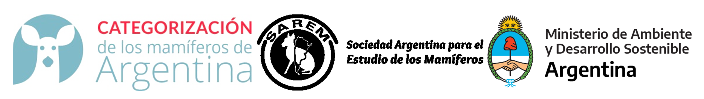

```{r setup, include=FALSE}
knitr::opts_chunk$set(echo = TRUE, include = FALSE)
library(rvest)
library(tidyverse)
library(kableExtra)
library(huxtable)
options(huxtable.latex_use_fontspec = TRUE)
source('R/funcs.R', local = knitr::knit_global())
```

```{r dataload}
db <- read_csv('data/especies_nativas.csv')
dois <- read_csv('data/species_doi.csv')

db.sp <- db %>% filter(title == params$species)

spDoi <- dois$DOI[ match(db.sp$title, dois$Especie) ] %>% str_trim()

cat.logo <- db.sp$sp_cat_nac_conserv_2019 %>% 
  str_split(' ', simplify = TRUE) %>% .[1] %>% tolower()

cat.logo <- paste0('images/', cat.logo, '.png')

commonCols <- c("sp_id", "sp_taxonomia_familia", "sp_taxonomia_orden", "title", 
"sp_nombre_cientifico", "sp_nombre_comun", "sp_cat_nac_conserv_2019", 
"sp_cat_nac_conserv_2019_justific", "sp_cat_sayds_conserv_2004", 
"sp_distribucion_historica_coment", "sp_habitos", "sp_autores_de_ficha"
)
doi <- 'doi:https://d.1025CMAoideprueba'
```
\setmainfont{Arial}
\setsansfont{Arial}
\setmonofont{Arial}

\newcommand\invisiblesection[1]{%
  \refstepcounter{section}%
  \addcontentsline{toc}{section}{\protect\numberline{\thesection}#1}%
  \sectionmark{#1}}
  
<!-- --- -->
<!-- title: "*`r db.sp$title`*" -->
<!-- subtitle: "**`r db.sp$sp_nombre_comun`**"    -->
<!-- --- -->

\fancyhead[R]{\textbf{`r spDoi`}}

\invisiblesection{GENERALIDADES}
\vspace{-0.4cm}

```{r logo.img, echo=FALSE, include=TRUE, out.width='100%'}

```

\vspace{1cm}

\begin{minipage}{0.7\textwidth}
\vspace{0.3cm}
\fontsize{20}{24}\selectfont\textit{`r db.sp$title`}

\vspace{0.3cm}
\fontsize{30}{36}\selectfont `r db.sp$sp_nombre_comun`
\end{minipage}
\hspace{0.05\textwidth}
\begin{minipage}{0.25\textwidth}
\includegraphics[width=\textwidth]{`r cat.logo`}
\end{minipage}

\normalsize


```{r image, fig.pos='H', echo=FALSE, include=TRUE, fig.align='center', out.width='35%',fig.cap= paste0("Fotos por ", "Salvador Dali")}
 knitr::include_graphics('photos/Blastocerus dichotomus.png'
   # paste0('photos/', db.sp$title, '.png')
   )
```

***

\justifying

**Citar como:** `r db.sp$sp_autores_de_ficha`. (2019). *`r db.sp$title`*. En: SAyDS--SAREM (eds.) Categorización 2019 de los mamíferos de Argentina según su riesgo de extinción. Lista Roja de los mamíferos de Argentina. `r spDoi`

***

\newpage

```{r map.sp, echo=FALSE, include=TRUE, results='asis'}
CMA_print_titles("ÁREA DE DISTRIBUCIÓN ACTUAL")%>% cat()
```

```{r map, fig.pos="H", echo=FALSE, include=TRUE, out.width="100%"}
knitr::include_graphics(
  paste0('maps/', db.sp$sp_taxonomia_orden, '/', 
         gsub(' ', '_', db.sp$title), '.png')
  )
```

```{r title.cons, echo=FALSE, include=TRUE, results='asis'}
CMA_print_titles("CATEGORÍAS DE CONSERVACIÓN")%>% cat()

```

\vspace{-0.4cm}

**Categoría Nacional de Conservación 2019**

`r db.sp$sp_cat_nac_conserv_2019`

**Criterios y subcriterios**

`r db.sp$sp_cat_nac_conserv_2019_criterio`

**Justificación de la categorización**

`r db.sp$sp_cat_nac_conserv_2019_justific`

```{r tabla-subpoblaciones, echo=FALSE, include=TRUE, results='asis'}
if(!is.na(db.sp$group_sp_eval_subpob)) {
  cat("**Evaluación de subpoblaciones locales**\n\n")

tbsPob <- CMA_subpop_cons(db.sp)

for(x in seq_along(tbsPob)){
  cat(paste0(tbsPob[[x]][[1]], collapse = '\\vspace{0.3cm}'))
  cat(paste0(tbsPob[[x]][[2]], collapse = '\\vspace{0.3cm}'))
  if(x != length(tbsPob)) cat('\\vspace{0.5cm}')
  }
}
```

**Categoría Res. SAyDS 1030/04**

`r db.sp$sp_cat_sayds_conserv_2004`

**Categorías nacionales de conservación previas (SAREM)**


\arrayrulecolor{white}

```{r title.taxo, echo=FALSE, include=TRUE,results='asis'}
CMA_print_titles("TAXONOMÍA Y NOMENCLATURA") %>% cat()
```

```{r title.eval, echo=FALSE, include=TRUE,results='asis'}
CMA_print_titles("INFORMACIÓN RELEVANTE PARA LA EVALUACIÓN") %>% cat()

```

```{r title.rango, echo=FALSE, include=TRUE,results='asis'}
CMA_print_titles("RANGO GEOGRÁFICO, OCURRENCIA Y ABUNDANCIA Y NOMENCLATURA") %>% cat()
```

```{r title.morfo, echo=FALSE, include=TRUE,results='asis'}
CMA_print_titles("DATOS MORFOMÉTRICOS") %>% cat()
```

```{r title.eto, echo=FALSE, include=TRUE,results='asis'}
CMA_print_titles("RASGOS ETO-ECOLÓGICOS") %>% cat()
```

```{r title.inves, echo=FALSE, include=TRUE,results='asis'}
CMA_print_titles("CONSERVACIÓN E INVESTIGACIÓN") %>% cat()
```

```{r title.biblio, echo=FALSE, include=TRUE,results='asis'}
CMA_print_titles("BIBLIOGRAFÍA") %>% cat()
```

\newpage

```{r title.autores, echo=FALSE, include=TRUE,results='asis'}
CMA_print_titles("AUTORES") %>% cat()
```

```{r cont.autores, echo=FALSE,include=TRUE, results='asis'}
CMA_parse_authors(db.sp) %>% 
  CMA_print_authors()
```

